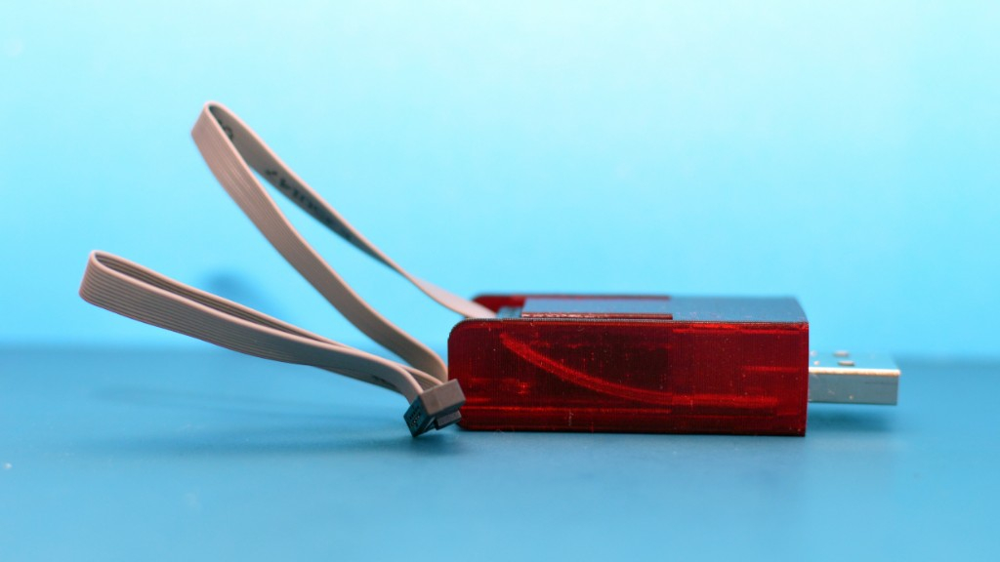
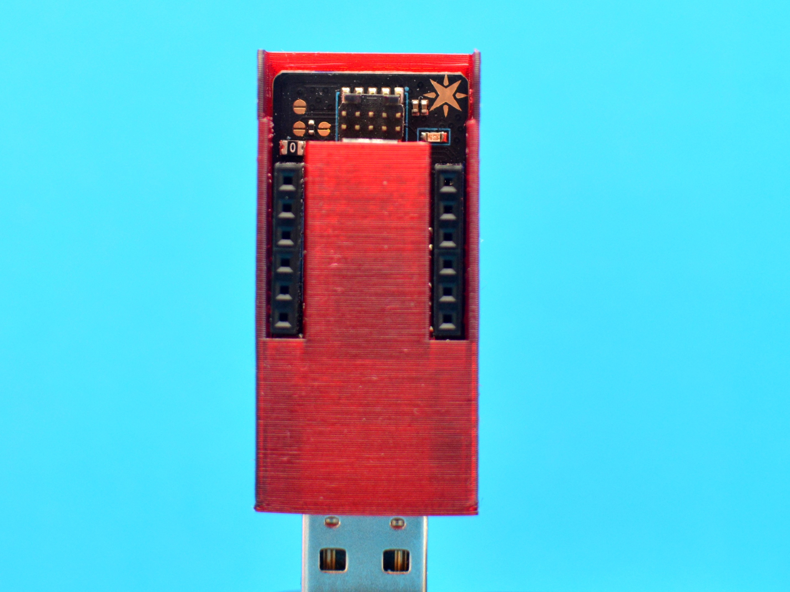

# Particle Debugger Case

A simple one piece sleeve case for the [Particle Debugger](https://store.particle.io/products/particle-debugger). 

To use, insert the board USB connector first (orient so headers are exposed).

Follow the guides on the sides until fully inserted, then press down on the ends of the board to secure it to
the base.

